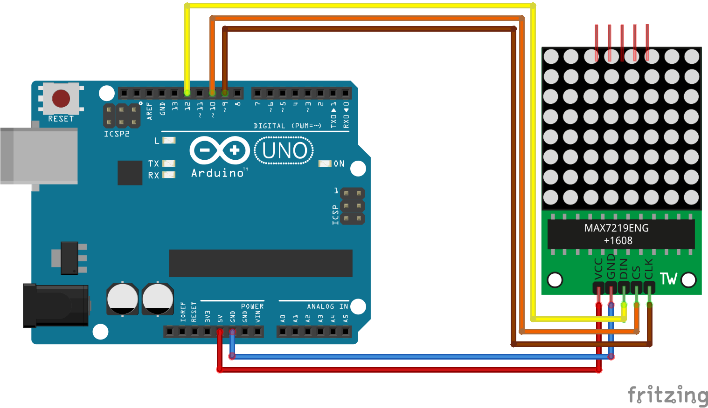
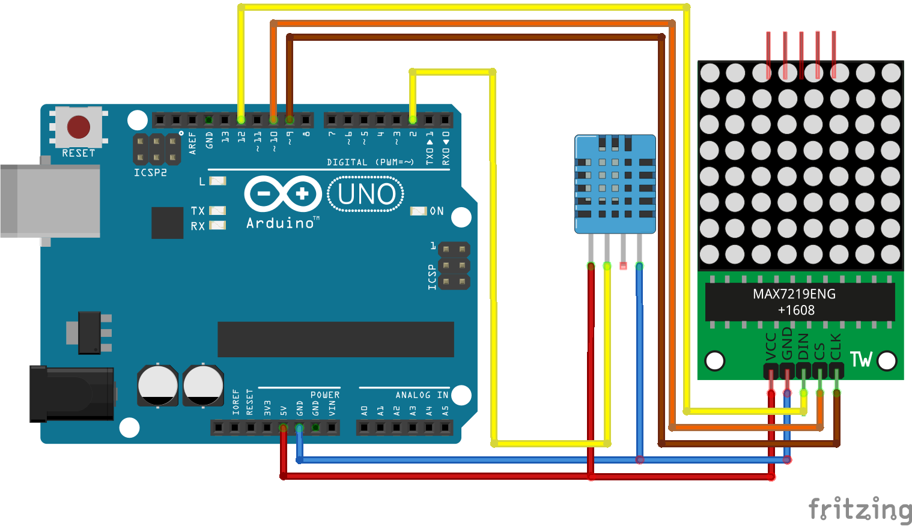

# Display Emotion
#### [readDHT11](https://github.com/adafruit/DHT-sensor-library)
  1. Install library
  2. connect the Circuit. 
  
  3. Code
  ```
  // Example testing sketch for various DHT humidity/temperature sensors
  // Written by ladyada, public domain

#include "DHT.h"

#define DHTPIN 2     // what digital pin we're connected to

// Uncomment whatever type you're using!
#define DHTTYPE DHT11   // DHT 11
//#define DHTTYPE DHT22   // DHT 22  (AM2302), AM2321
//#define DHTTYPE DHT21   // DHT 21 (AM2301)

// Connect pin 1 (on the left) of the sensor to +5V
// NOTE: If using a board with 3.3V logic like an Arduino Due connect pin 1
// to 3.3V instead of 5V!
// Connect pin 2 of the sensor to whatever your DHTPIN is
// Connect pin 4 (on the right) of the sensor to GROUND
// Connect a 10K resistor from pin 2 (data) to pin 1 (power) of the sensor
// (Dyel's) If module, not necessary connect as resgister.

// Initialize DHT sensor.
// Note that older versions of this library took an optional third parameter to
// tweak the timings for faster processors.  This parameter is no longer needed
// as the current DHT reading algorithm adjusts itself to work on faster procs.
DHT dht(DHTPIN, DHTTYPE);

void setup() {
  Serial.begin(9600);
  Serial.println("DHTxx test!");

  dht.begin();
}

void loop() {

  // Reading temperature or humidity takes about 250 milliseconds!
  // Sensor readings may also be up to 2 seconds 'old' (its a very slow sensor)
  float h = dht.readHumidity();
  // Read temperature as Celsius (the default)
  float t = dht.readTemperature();

  // Check if any reads failed and exit early (to try again).
  if (isnan(h) || isnan(t)) {
    Serial.println("Failed to read from DHT sensor!");
    return;
  }

  float temp = t;
  float humi = h;
}
  ```

#### [calculateDI](http://web.kma.go.kr/notify/epeople/faq.jsp?bid=faq&mode=view&num=130&page=1&field=&text=&schGrp=09)
```
//RH : 상대습도(소수단위), T : 기온(℃)
dI = (9/5)T - 0.55(1-RH)[(9/5)T -26) + 32;
```

#### [DisplayEmotion:I2CDotMatrix](https://github.com/wayoda/LedControl)

  1. install library
  2. connect the Circuit.
  
  3. code
  ```
  //We always have to include the library
#include "LedControl.h"

/*
 Now we need a LedControl to work with.
 ***** These pin numbers will probably not work with your hardware *****
 pin 12 is connected to the DataIn 
 pin 11 is connected to the CLK 
 pin 10 is connected to LOAD 
 We have only a single MAX72XX.
 */
LedControl lc=LedControl(12,11,10,1);

/* we always wait a bit between updates of the display */
unsigned long delaytime=100;

void setup() {
  /*
   The MAX72XX is in power-saving mode on startup,
   we have to do a wakeup call
   */
  lc.shutdown(0,false);
  /* Set the brightness to a medium values */
  lc.setIntensity(0,8);
  /* and clear the display */
  lc.clearDisplay(0);
}

/*
 This method will display the characters for the
 word "Arduino" one after the other on the matrix. 
 (you need at least 5x7 leds to see the whole chars)
 */
void writeArduinoOnMatrix() {
  /* here is the data for the characters */
  byte a[5]={B01111110,B10001000,B10001000,B10001000,B01111110};
  byte r[5]={B00111110,B00010000,B00100000,B00100000,B00010000};
  byte d[5]={B00011100,B00100010,B00100010,B00010010,B11111110};
  byte u[5]={B00111100,B00000010,B00000010,B00000100,B00111110};
  byte i[5]={B00000000,B00100010,B10111110,B00000010,B00000000};
  byte n[5]={B00111110,B00010000,B00100000,B00100000,B00011110};
  byte o[5]={B00011100,B00100010,B00100010,B00100010,B00011100};

  /* now display them one by one with a small delay */
  lc.setRow(0,0,a[0]);
  lc.setRow(0,1,a[1]);
  lc.setRow(0,2,a[2]);
  lc.setRow(0,3,a[3]);
  lc.setRow(0,4,a[4]);
  delay(delaytime);
  lc.setRow(0,0,r[0]);
  lc.setRow(0,1,r[1]);
  lc.setRow(0,2,r[2]);
  lc.setRow(0,3,r[3]);
  lc.setRow(0,4,r[4]);
  delay(delaytime);
  lc.setRow(0,0,d[0]);
  lc.setRow(0,1,d[1]);
  lc.setRow(0,2,d[2]);
  lc.setRow(0,3,d[3]);
  lc.setRow(0,4,d[4]);
  delay(delaytime);
  lc.setRow(0,0,u[0]);
  lc.setRow(0,1,u[1]);
  lc.setRow(0,2,u[2]);
  lc.setRow(0,3,u[3]);
  lc.setRow(0,4,u[4]);
  delay(delaytime);
  lc.setRow(0,0,i[0]);
  lc.setRow(0,1,i[1]);
  lc.setRow(0,2,i[2]);
  lc.setRow(0,3,i[3]);
  lc.setRow(0,4,i[4]);
  delay(delaytime);
  lc.setRow(0,0,n[0]);
  lc.setRow(0,1,n[1]);
  lc.setRow(0,2,n[2]);
  lc.setRow(0,3,n[3]);
  lc.setRow(0,4,n[4]);
  delay(delaytime);
  lc.setRow(0,0,o[0]);
  lc.setRow(0,1,o[1]);
  lc.setRow(0,2,o[2]);
  lc.setRow(0,3,o[3]);
  lc.setRow(0,4,o[4]);
  delay(delaytime);
  lc.setRow(0,0,0);
  lc.setRow(0,1,0);
  lc.setRow(0,2,0);
  lc.setRow(0,3,0);
  lc.setRow(0,4,0);
  delay(delaytime);
}

/*
  This function lights up a some Leds in a row.
 The pattern will be repeated on every row.
 The pattern will blink along with the row-number.
 row number 4 (index==3) will blink 4 times etc.
 */
void rows() {
  for(int row=0;row<8;row++) {
    delay(delaytime);
    lc.setRow(0,row,B10100000);
    delay(delaytime);
    lc.setRow(0,row,(byte)0);
    for(int i=0;i<row;i++) {
      delay(delaytime);
      lc.setRow(0,row,B10100000);
      delay(delaytime);
      lc.setRow(0,row,(byte)0);
    }
  }
}

/*
  This function lights up a some Leds in a column.
 The pattern will be repeated on every column.
 The pattern will blink along with the column-number.
 column number 4 (index==3) will blink 4 times etc.
 */
void columns() {
  for(int col=0;col<8;col++) {
    delay(delaytime);
    lc.setColumn(0,col,B10100000);
    delay(delaytime);
    lc.setColumn(0,col,(byte)0);
    for(int i=0;i<col;i++) {
      delay(delaytime);
      lc.setColumn(0,col,B10100000);
      delay(delaytime);
      lc.setColumn(0,col,(byte)0);
    }
  }
}

/* 
 This function will light up every Led on the matrix.
 The led will blink along with the row-number.
 row number 4 (index==3) will blink 4 times etc.
 */
void single() {
  for(int row=0;row<8;row++) {
    for(int col=0;col<8;col++) {
      delay(delaytime);
      lc.setLed(0,row,col,true);
      delay(delaytime);
      for(int i=0;i<col;i++) {
        lc.setLed(0,row,col,false);
        delay(delaytime);
        lc.setLed(0,row,col,true);
        delay(delaytime);
      }
    }
  }
}

void loop() { 
  writeArduinoOnMatrix();
  rows();
  columns();
  single();
}
  ```

## Project

```
#include "DHT.h"
#include "LedControl.h"

#define DHTPIN 2

#define DHTTYPE DHT11   // DHT 11

DHT dht(DHTPIN, DHTTYPE);
LedControl lc=LedControl(12,11,10,1);

unsigned long delaytime=100;

void setup() {
  Serial.begin(9600);
  Serial.println("DHTxx test!");

  dht.begin();
  lc.shutdown(0,false);
  lc.setIntensity(0,8);
  lc.clearDisplay(0);
}

void loop() {
  float h = dht.readHumidity();
  float t = dht.readTemperature();

  if (isnan(h) || isnan(t)) {
    Serial.println("Failed to read from DHT sensor!");
    return;
  }

  int dI = calculateDI(t, h);
  displayEmotion()
 
}
void diplayEmotion(int array[]){
  for(int i=0;i<8;i++)
    lc.setRow(0,0,array[i]);//DotMatrix number, line, array
  delay(delayTime);  
}
```
