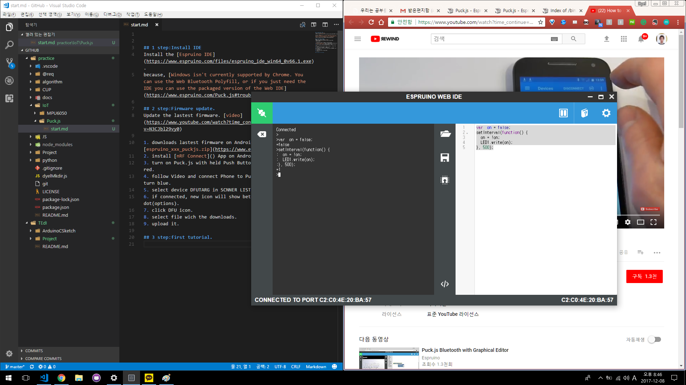

## 1 step:Install IDE
Install the [Espruino IDE](https://www.espruino.com/files/espruino_ide_win64_0v66.1.exe).
because, [Windows isn't currently supported by Chrome. You can use the Web Bluetooth Polyfill, or if you just need the IDE you can use the packaged version of the Web IDE](https://www.espruino.com/Puck.js#troubleshooting).

## 2 step:Firmware update.
Update the lastest firmware. [video](https://www.youtube.com/watch?time_continue=123&v=N3CJbl29vy0)

1. downloads lastest firmware on Android Phone. [espruino_xxx_puckjs.zip](https://www.espruino.com/binaries/)
2. install [nRF Connect]() App on Android Phone.
3. turn on Puck.js with held Push Button. led will be turn red.
4. follow Video and connect Phone to Puck.js. led will be turn blue.
5. select device DFUTARG in SCNNER LIST.
6. if connected, new icon will show beteen DISCONNECT and 3 dot(options).
7. click DFU icon.
8. select file wich the downloads.
9. upload it.

## 3 step:first tutorial.
